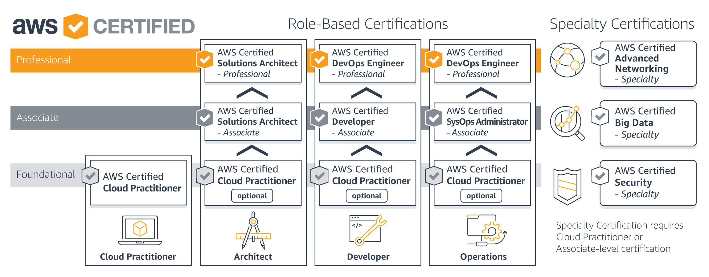

## 모임이 추구하는 가치
 * 개인의 전문성 확보. 전문성 확보 과정에서의 즐거움.

## 가치 추가에 따른 기대 결과
위 가치를 이루기 위한 과정에서 얻을 수 있을 것으로 기대하는 결과들
 * 개인의 전문성을 사회에 발현시킨다. 안정적이고 빠르고, 적절한 서비스를 개발. 이런 서비스를 개발 할 수 있는 인프라 혹은 플랫폼을 설계하고 그 결과를 회사에 제안하고 그 위에서 개발을 할 수 있다.
 * 전문성을 확보한 공동체(네트워크) 구성 
 * 사회 & 서비스 & 기술 변화에 공동체로 적응. 정보 공유, 커리어 설계, 기술적인 도움, 직업 및 사업 기회 발굴.
 * AWS 커뮤니티에서 공식적으로 전문성을 인정 받음.

## AWS 자격증 자체의 가치
  * 높은 가용성, 확장성, 안정성, 보안성을 가지는 애플리케이션과 서비스 설계/배포/운영을 위한 전문성을 보유하고 있음을 입증.
  * AWS 관련 기술 숙련도에 대한 가시적인 증명
  * 고용주와 동료간 신뢰조성

## 모임 운영 방식
아직 결정된 건 없습니다. 논의해서 바뀔 수 있습니다.
  * 기수 방식으로 닫힌 커뮤니티
  * 5명 정도로 시작 주 1회 매주 금요일 모임 : 첫 번째 모임은 10월 5일로 계획
  * 어떤 이유로 모임에 참여하지 못했을 경우, 해당 모임에서의 정보들은 git 문서 (문서 작성이 늦어지거나 충분한 내용을 담지 못할 수 있으므로)혹은 개인적으로 습득한다.
  * 현업 실무자 중심
  * 초기에는 범용적인 정보를 습득할 수 있다고 생각되는 솔류션 아키텍트 영역을 집중하고, 이후 DevOps, 개발, 스페셜 영역으로 세분화. 
  * 기수는 목표로하는 자격증이 있다. 
  * 새로만들어지는 기수의 경우, 이전 기수에서 그룹을 리딩하는 역할을 수행 한다. 

## 모임 준비 사항
AWS 자격증 로드맵을 만들어서 자격증을 취득하는게 목표입니다. 모든 내용은 AWS 웹 콘솔 혹은 AWS CLI를 이용해서, 직접 개발&테스트를 하면서 진행 자신의 것으로 만들려고 합니다. 따라서 아래의 것들을 미리 준비하고 테스트해야 합니다.
  * AWS 계정 생성 - 필수 
  * AWS 계정 생성 후 VM 생성을 하고 접속을 한다. - 필수
  * IAM을 발급 받아서 CLI를 이용 VM 목록을 확인하고 VM을 생성한다. - 옵션

## 학습 방향
AWS&클라우드 기술을 체화해야겠지만 "목표는 자격 취득"입니다.
  * 각 로드맵 단계에서의 FAQ 문서
  * 각 로드맵 단계에서의 AWS 기술 백서
  * 각 로드맵을 위해서 AWS 공식 사이트에서 제공하는 문서들
을 중점적으로 다룹니다.

단 실제 업무 환경에서의 적용 & 경험을 통한 체화도 목표 중 하나이므로, 각 단계에서의 리더는 서비스 시나리오를 만들어서 공유 할 수 있도록 길잡이 역할을 하게 됩니다. 예를 들어 Solution Architect 라면
  * 로컬에서의 이미지 처리 고가용성 서비스에 대한 레퍼런스 아키텍처를 만들고, 세부 컴포넌트들을 어떻게 구성해야 할지를 "자격 취득 학습을 통해서 얻은 지식을 기반으로" 토론한다.
  * 토론을 기반으로 간단한 서비스 구성을 과제로 하고 토론한다.
등의 심화학습을 계획 합니다.

## 자격증 로드맵

### 초기 스터디 순서
 * [클라우드 컨셉](cloud-practitioner-essentials)

### AWS Certified Cloud Practitioner
클라우드 개념, AWS 서비스, 보안, 아키텍처, 요금 및 지원에 대한 개요를 제공한다. AWS에 대한 기초로 전반적인 내용을 다룬다. Associate와 Professional을 위한 기본단계다. 이 자격은 "옵션"이다. 
  * AWS의 실무 적용만이 목표라면 굳이 들을 필요는 없겠으나, 목표가 "자격증 취득"이므로 읽어야 한다.
  * AWS Certified Cloud Practitioner : [AWS Cloud Practitioner essentials](https://aws.amazon.com/ko/training/course-descriptions/cloud-practitioner-essentials/)를 각자 학습 후 1회 토론으로 끝낸다. 

### AWS Certified Solution Architect 
#### Associate 등급
#### Professional 등급

### AWS Certified Developer 
#### Associate 등급
#### Professional 등급

### AWS Certified DevOps Engineer 
#### Associate 등급
#### Professional 등급

### AWS Specialty Certifications 
#### AWS Certified Advanced Networking
#### AWS Certified Big Data 
#### AWS Certified Security 
