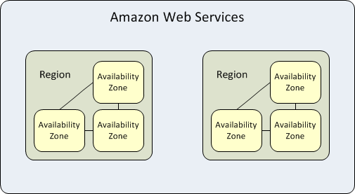

운영자와 개발자를 구분하지 않는다.
## AWS 클라우드 소개
이 과정의 목표는 아래와 같다.
 * 클라우드 컴퓨팅이 무엇인지 설명할 수 있어야 한다.
 * AWS 클라우드 서비스가 무엇인지 설명할 수 있어야 한다. 
 * AWS가 기존 온프레미스 방식대비 고객에게 어떤 장점을 줄 수 있는지 설명할 수 있어야 한다. 개발자 혹은 운영자의 경우 "클라우드 환경을 사용해야 하는 동기를 부여"할 수 있을 것이며, 고객에게는 "AWS를 이용하도록 설득 할 수 있을 것이다.
 * AWS가 기존 온프레미스 방식대비 어떤 단점이 있으며, 어떻게 보완할 수 있는지 설명할 수 있어야 한다.

## 클라우드란 무엇인가 ?
클라우드 컴퓨팅이란 인터넷을 통해서 IT 자원과 애플리케이션을 "온디멘드"로 제공하는 서비스를 의미한다. 사용자는 "전기"나 "수도"처럼 필요한 영역에서 필요한 만큼만 "요청해서 사용" 할 수 있으며, 마찬가지로 "사용한 만큼" 요금을 지불한다. 다른 서비스와 마찬가지로 대량으로 자원을 사용 할 경우, 각종 할인을 받을 수 있다.

클라우드 컴퓨팅이전에 개발자는 서비스 종류, 목표 유저, 사용 패턴, 주요 사용 시간 등의 여러 요소들의 정보를 수집해서 사용량을 추측한 다음, 최대치를 기반으로 자원을 전개해야 했다. 실제 서비스가 예측한 최대치에 미치지 못할 경우 구입한 리소스가 유휴 상태를 유지할 수 있으며 반대로 예상을 초과할 경우 고객의 수요를 충족하지 못할 수 있었다. 설치공간, 전력, 냉방, 운영비용등의 간접비는 덤으로 추가 된다. 서비스 종류, 사용 유저와 같은 것들 외에, 사용하는 소프트웨어의 종류, 개발 언어, 설계 등에 크게 영향을 받을 수 있기 때문에 개발자는 용량산정에 많은 시간을 소비해야 했다.

AWS를 사용할 경우 서버, 데이터베이스, 스토리지, (메시지 큐와 같은)상위 수준 애플리케이션을 몇 초만에 시작 할수 있다. 마치 "프로세스"처럼 일시적이고 처분가능한 리소스로 취급할 수 있기 때문에, "고정적이고 유한한 IT 인프라의 구성"이라는 비융통성과 물리적 제약에서 벗어날 수 있게됐다.

## 클라우드로 마이그레이션하는 이유
기업들이 클라우드로 마이그레이션하는 가장 큰 이유는 *뛰어난  민첩성*에 있다. 민첩성은 아래 3가지 요소에 영향을 미친다.
  * 속도
  * 실험(실험 & 시행착오의 사이클 압축)
  * 혁신 
### 속도
AWS의 물리적 인프라는 전 세계에 분포하고 있으며, 소프트웨어(API)방식으로 인프라를 사용 할 수 있다. 따라서 고객은 몇 분만에(혹은 몇 번의 클릭으로) 글로벌환경에 컴퓨팅자원을 전개 할 수 있다.

고객은 자체 데이터센터를 두는 방법을 생각 할 수 있지만, 비용과 시간상 불가능 할 수 있다. AWS를 사용 할 경우 막대한 투자를 할 필요 없이, 필요한 만큼 컴퓨팅자원을 사용 할 수 있다.

개발자는 하드웨어를 소프트웨어처럼 다룰 수 있게 됐는데, 이는 컴퓨팅자원을 소프트웨어 주기에 맞춰서 전개 할 수 있다는 것을 의미한다. 명령어와 엔터키를 이용해서 소프트웨어를 실행하는 것처럼 API 호출, CLI 호출 혹은 웹 콘솔에서의 버튼클릭으로 컴퓨팅자원을 전개 할 수 있다. 개발자는 몇 주 혹은 몇 달이(용량산정의 어려움과 비용제약, 몇 단계의 결제 프로세스를 밟을 경우 몇 달이 걸릴 수 있다) 아니라 몇 분만에 컴퓨팅자원을 사용 할 수 있다. 

개발자가 하드웨어의 주기를 소프트웨어 주기에 맞출 수 있게 됐다. 이는 개발자와 조직의 민첩성을 극적으로 향상시킨다. 기존의 소프트웨어 주기는 애자일 방식을 따르고 있을 건데, 하드웨어를 애자일에 녹여낼 수 있게 됐다. 이걸 우리는 DevOps라고 부른다. 

### 실험
*보다 많은 실험을 할 수 있다*는 것은 클라우드의 또 다른 이점이다. AWS를 사용할 경우, 컴퓨팅자원은 소프트웨어처럼 테스트하고 디버깅 할 수 있다. 개발자는 안전한 환경에서 서비스를 전개하고, 실험하고, 운영 절차를 미리 테스트 할 수 있다. 주의깊은 개발자는 장애를 재현하고 이를 모니터링하기 위한 일련의 테스트 절차를 만들기도 한다.

개발자는 자주 사용하는 작업과정과 기능을 코드(라이브러리)형태로 관리하곤 한다. AWS CloudFormation을 이용하면, 컴퓨팅형상을 코드화 할 수 있다. 일종의 템플릿인데, 개발자는 템플릿으로 부터 격리된 개발&테스트&QA&프러덕션 환경을 전개 할 수 있다. 이는 개발에서 배포까지의 운영제어의 연속성을 보장해주며, (코드를 유지보수하는 것처럼)지속적으로 확장 할 수 있게 한다. 

### 혁신
혁신의 동력은 탐색과 실행 그리고 속도다. 클라우드 컴퓨팅은 낮은 비용으로 빠르게 자원을 전개 할 수 있기 때문에, 탐색한 아이디어를 즉시 실행할 수 있도록 도와준다. 개발자는 실행의 과정에서 시행착오를 거칠 수 있는데, 과정이 압축되기 때문에 여러번 실행할 수 있고 아이디어를 최적으로 구현할 수 있다.

## 클라우드 컴퓨팅에서 민첩성 확보 방법
AWS가 민첩성확보 방법을 이해하기 위해서는 AWS가 어떻게 *탄력성, 확장성, 안정성*을 지원하는지 살펴봐야 한다.

