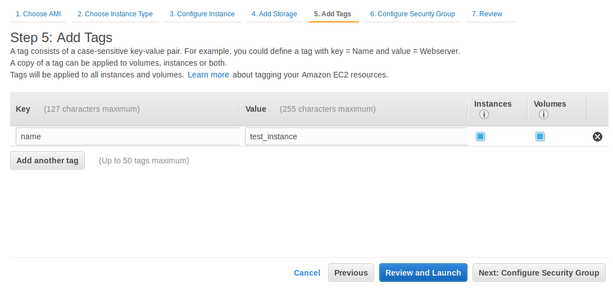

## AWS 핵심 서비스 
AWS를 기반하는 서비스를 설계할 때, 필수로 사용하는 서비스들을 살펴본다. 이들 서비스는 네트워크, 스토리지, 컴퓨팅, 데이터베이스, 빅데이터 등의 범주를 대표한다. 각각의 범주는 상당히 광범위한 내용을 다루므로 여기에서는 개략적인 설명만을 다루고, 각각에 대해서는 별도의 문서를 통해서 자세히 학습할 것이다.

## AWS 서비스 범주 소개 
AWS는 아래의 주요 서비스 범주를 가지고 있다.
  * 컴퓨팅
  * 스토리지
  * 데이터베이스
  * 네트워킹

### 컴퓨팅 
AWS는 EC2(Elastic Computing Cloud)라는 컴퓨팅 서비스를 제공한다. *메모리, CPU, 스토리지*로 구성된 물리적인 컴퓨터 시스템의 추상화다. 가상머신(Virtual Machine) 서비스라고 이해하면 된다.

컴퓨터 시스템이 다양한 CPU, Memory, Disk 용량을 가지듯이 EC2도 목적에 따른 다양한 "인스턴스 타입", "요금"등을 지원한다. 예를들어 개발자는 실행하려는 워크로드에 따라서 CPU 우선, 메모리 우선, GPU 우선등과 같은 적절한 인스턴스 타입과 CPU 갯수, 메모리 크기와 같은 용량을 선택해서 실행 할 수 있다. 또한 리눅스, 윈도우즈와 같은 운영체제를 선택할 수 있다.

EC2는 운영체제와 애플리케이션을 저장하기 위한 *블럭 스토리지*가 필요한데, EBS(Elastic Block Store)를 이용해서 스토리지를 EC2 인스턴스에 붙일 수(attach)할 수 있다. EBS는 하드디스크 서비스라고 볼 수 있다. AWS는 하드디스크 타입과 SSD 타입의 EBS 서비스를 제공하며, IOPS 설정 서비스도 제공한다.

### 데이터베이스
AWS는 Aurora, Amazon RDS, Amazon DynamoDB, Amazon Redshift등의 데이터베이스 서비스를 제공한다. 가용성, 확장성, 백업, 복구 등 일체의 관리를 AWS에 위임할 수 있다.

### 네트워크
AWS의 VPC는 네트워크 서비스다. 유저는 IP 기반의 네트워크를 할당받아서, 서브넷을 구성하고 라우터를 이용 인바운드&아웃바운드 트래픽을 제어 할 수 있다.

## AWS 글로벌 인프라
AWS는 전 지구를 커버하기 위한 글로벌 인프라를 제공한다. AWS의 글로벌 인프라는 *리전(Region), 가용영역(AZ), 엣지 로케이션(Edge location)*의 3개 요소로 구성된다.

### 리전
[AWS global infrastructure](https://aws.amazon.com/ko/about-aws/global-infrastructure/)에서 아래와 AWS의 글로벌 인프를 확인 할 수 있다.


리전은 2개 이상의 가용영역(AZ)을 호스팅하는 지리영역을 가리킨다. 개발자가 인터넷 서비스를 전개하려고 하면 리전 중 하나를 선택할 수 있다. 당연히 서비스 지역과 가까운 위치의 리전을 선택할 것인데, "서비스 지연(latency)"에 직접적인 영향을 줄 것이기 때문이다.

예를 들어 대한민국을 목표로하는 서비스라면 서울리전에 배포를 할 것이다. 

각 리전간에는 사용 할 수 있는 AWS 서비스에 있어서 약간의 차이가 있다. [리전 테이블](https://aws.amazon.com/ko/about-aws/global-infrastructure/regional-product-services/)에서 리전간 제공 서비스 목록을 확인 할 수 있다.

따라서 개발자는 *가까운 리전*과 *리전에서 제공하는 기능 테이블* 두개를 비교해서 서비스를 선택해야 한다. 서비스에서 필요로 하는 모든 기능을 가까운 리전에서 제공한다면, 당연히 그 리전을 선택해야 되겠지만, 기능을 제공하지 않을 경우 고민이 필요 할 수 있다.

예를들어 DynamoDB Accelerator(DAX)의 경우 도쿄리전은 제공하지만 서울리전은 제공하지 않는다. DAX는 서비스 성능을 높이기 위한 기능이므로 서비스에 직접적인 영향을 끼치지는 않는다. 일반적인 상황에서 DAX 때문에 문제가 되는 경우는 없을테니, 서울리전에 구성하는게 나을 테다.

반면 비디오 서비스를 한다면 *Amazon Elastic Transcoder*가 있는 것과 없는 것은 꽤 큰 차이가 될 수 있다. 도쿄리전은 지원하지만 서울리전은 지원하지 않는데, 이 경우 Elastic Transcoder 관련 작업만 도쿄리전에서 수행하는 등의 고민을 해야 할 것이다.

### 가용영역
가용영역은 특정 리전에 존재하는 데이터센터의 모음이다. 

가용영역은 다른 가용영역과 물리적,논리적으로 분리된다. 각 가용영역은 별도의 무정전 전원 공급장치(UPS), 예비 발전기, 냉각 장비, 네트워크, 전력망을 갖추고 있다. 하나의 리전은 두 개 이상의 가용영역으로 구성이 되는데, 서비스를 AZ에 분산해서 배치하면 AZ의 장애로 부터 안전한 서비스를 만들 수 있다. 

예를 들어 AZ-A와 AZ-B에 웹서버를 분산해 놓으면, AZ-A에 네트워크, 시스템, 소프트웨어 적인 문제가 생기더라도 AZ-B에서 작동중인 웹서버로 서비스를 계속 할 수 있다. 애초에 *가용 영역*이라는 용어 자체가 *가용성을 높이기 위한*이라는 의미를 함축하고 있다.

### 엣지로케이션
AWS는 *CloudFront*라는 CDN 서비스를 제공한다. 엣지로케이션(Edge Location)은 CloudFront를 제공하는 서비스 인프라다. CloudFront는 컨텐츠의 사본을 캐시해서 유저에게 빠르게 컨텐츠를 서비스하기 위해서 사용한다. 엣지로케이션은 CloudFront와 Route 53(도메인 서비스)에 대한 요청을 처리해서 사용자가 좀더 빠르게 서비스를 사용 할 수 있도록 한다. 


## Amazon Virtual Private Cloud(VPC)
### 소개
AWS VPC(Virtual Private Cloud)는 aws의 네트워크 서비스다. 전개하는 애플리케이션은 네트워크위상에 존재를 한다. 이 네트워크는 전통적인 *TCP/IP* 네트워크다. 클라우드 환경에서도 TCP/IP 네트워크를 개발자가 제어를 해야 하느냐라는 물음이 있을 수 있다. 이에 대한 답은 아래와 같다.
  * 90% 이상의 애플리케이션들은 TCP/IP 네트워크를 기반으로 한다. 특히 인터넷 애플리케이션이라면 100%라고 보면 된다.
  * 인터넷 서비스는 프론트앤드와 백앤드를 막론하고 TCP/IP 네트워크를 기반으로 한다.
  * 애플리케이션 배치, 보안에 대한 노하우도 TCP/IP 기준이다.
즉, 인터넷 서비스가 *서버리스(Serverless) 기반*에서 개발하지 않는 한, 전통적인 TCP/IP 네트워크를 구성해야 한다. 

개발자는 VPC를 이용해서 IP 주소공간, 서브넷(subnet), 라우팅 테이블과 같은 네트워크 구성 요소를 제어할 수 있다. 이를 통해서 인터넷에서 노출되는 자원과 격리해야 하는 자원을 제어할 수 있다.

개발자는 각 서브넷의 격리, 트래픽 흐름의 제어, 멀티닉을 이용한 트래픽 격리, ACL 정의, 라우팅 규칙등을 설정할 수 있다. 또한 수신 트래픽과 송신 트래픽을 허용 혹은 거부 할 수 있다. 

AWS의 EC2(Elastic Cloud Compute), RDS(Relational Database Service), ElasticCache 등 많은 AWS 서비스들이 개발자가 만든 VPC위에 배포된다. 이렇게 배포된 자원은 온프레미스 네트워크와 동일한 구조로 보호할 수 있다. VPC를 이해하면, AWS의 다른 서비스들도 통합할 수 있게 된다.

### 기능들
#### 리전과 AZ을 이용한 고가용성(High availability) 구성
VPC는 리전단위로 만들 수 있다. 리전은 하나 이상의 가용영역으로 구성되기 때문에, 개발자는 VPC를 만들 때, 네트워크가 가용영역으로 분산되도록 만들 수 있다. 


서브넷을 AZ에 분산하는 것만으로 고가용성 시스템을 구성 할 수 있다. 예를들어 웹 애플리케이션 서버를 고가용성 구성으로 하고 싶다면, 3개의 서브넷을 3개의 AZ으로 구성하고, 각 서브넷에 애플리케이션 서버를 실행하면 된다. 이들 애플리케이션 서비스들은 ELB(Elastic Load balancer)로 묶으면 된다. 특정 AZ에 문제가 생겨서 서버에 연결할 수 없을 경우, 다른 AZ의 서버가 요청을 처리하게 된다. ELB는 자동으로 문제가 생긴 AZ로 요청을 보내지 않도록 조절하는 기능을 가지고 있다. 

#### 서브넷(Subnet)
VPC는 하나 이상의 서브넷을 가질 수 있다. 서브넷은 하나의 큰 네트워크를 여러개의 작은 네트워크로 나누기 위해서 사용한다. 서브넷은 애플리케이션의 격리, 네트워크간 트래픽 컨트롤, 보안, 트래픽 분리 와 같은 다양한 목적으로 나눈다. 서브넷이 많아지면 네트워크 토폴로지가 복잡해질 수 있으므로 적절한 설계가 필요하다.

개발자는 서브넷과 서브넷, 서브넷과 인터넷 사이의 트래픽을 제어하기 위해서 라우팅 테이블을 구성할 수 있다. 기본적으로 VPC 내의 모든 서브넷은 서로 통신 할 수 있다.    

서브넷은 퍼블릭 서브넷(Public subnet)과 프라이빗 서브넷(Private subnet)으로 분류 할 수 있다. 퍼블릭 서브넷은 인터넷(퍼블릭 네트워크)에서 직접 접근 할 수 있는 네트워크다. 반면 프라이빗 서브넷은 인터넷에서 접근 할 수 없다. 보통 퍼블릭 서브넷은 웹 서버, 웹 애플리케이션 서버와 같이 유저가 직접 접근해야 하는 서버를 배치하고 프라이빗 서브넷에는 데이터베이스와 같은 인터넷으로 부터 보호해야 하는 서버를 배치한다. 

서브넷이 *인터넷 게이트웨이(Internet gateway)*와 연결돼 있다면 퍼블릭 서브넷, 그렇지 않다면 프라이빗 서브넷이 된다.

#### 인터넷 게이트웨이(IGW)
인터넷 게이트웨이는 VPC 네트워크와 인터넷을 연결하는 관문역할을 한다. 퍼블릭 서브넷은 인터넷 게이트와 연결(attach)이 된다. 여기에 EC2를 배치하고, EIP 혹은 Public IP를 설정하면 인터넷에서 접근 할 수 있다. 

#### NAT 게이트웨이
프라이빗 서브넷의 EC2는 인터넷과 통신할 수 없다. 하지만 외부 API 호출, 외부 데이터 수집 등의 목적으로 *인터넷에 접근*이 필요한 경우가 있다. 이때는 NAT 게이트웨이를 설치해야 한다.

원리는 간단하다.
  * 퍼블릭 서브넷에 NAT 전용 EC2를 전개하고 NAT 설정을 한다.
  * 프라이빗 서브넷에서 0.0.0.0/0(인터넷)으로 향하는 트래픽이 NAT로 향하게 한다.
  * 프라이빗 서브넷의 EC2는 NAT 게이트웨이를 이용해서 인터넷에 접근할 수 있다.

AWS에서 NAT 게이트웨이를 서비스 하지 않을 때는 개발자가 EC2 인스턴스를 실행하고 NAT 설정을 해야 했으나, 지금은 AWS의 NAT 게이트웨이 서비스를 사용 할 수 있다.

#### Network Access Control Lists(NACL) 
VPC네트워크에서 서브넷간 트래픽의 접근을 제어한다. 시큐리티 그룹(Security group)과 비슷한데, 시큐리티그룹은 호스트 단위에서 트래픽을 제어한다.

#### 메인 퀘스트
AWS에서 VPC를 만든다. 아래의 퀘스트를 모두 수행해야 한다. 메인 퀘스트와 서브 퀘스트로 구성된다. 메인 퀘스트는 필수, 서브 퀘스트는 옵션이다.
  * 10.0.0.0/16 네트워크를 가지는 VPC를 만든다. 약 65,000개의 호스트를 관리할 수 있는 크기다. 
  * VPC에 퍼블릭 서브넷과 프라이빗 서브넷 2개의 서브넷을 만든다.
  * 퍼블릭 서브넷과 프라이빗 서브넷에 EC2 인스턴스를 만든다.
  * EC2 인스턴스간 통신이 되는지 확인한다. 
  * 퍼블릭 서브넷에 잇는 EC2 인스턴스에 Public IP를 할당해서, 인터넷에서 연결되는지 확인한다.

#### 서브 퀘스트
  * 서브넷에 대해서 살펴보기 
  * 퍼블릭 서브넷에서 프라이빗 서브넷으로 8080 포트로만 접근 할 수 있도록 NACL을 설정한다.
  * 우리가 만든 VPC의 네트워크 구성도를 그린다.
  * 프라이빗 서브넷에 있는 EC2 인스턴스에 접근하고 싶다. 어떻게 해야 할까. 

### 시큐리티 그룹(Security Group) 
클라우드는 컴퓨팅 파워, 네트워크, 스토리지, 소프트웨어를 대여하는 서비스다. 여러 기업들이 클라우드로 부터 자원을 대여하기 때문에 AWS는 다양한 보안 장치와 서비스들을 제공한다. 개발자들이 사용할 수 있는 일차 보안 장치가 *시큐리티그룹*이다.  

시큐리티 그룹은 일종의 방화벽으로 호스트(EC2와 같은)에서 작동한다. 시큐리티 그룹은 iptables와 같은 방화벽이 그렇듯이, IP와 Port를 기반으로 입/출력 트래픽을 제어한다. 이를테면  
  * 웹서버에서 웹 서비스 : 출발지가 0.0.0.0/0(Any) 이고 목적지가 80과 443인 트래픽만 허용한다.  
  * 웹서버에서 ssh 접근 : 관리를 위해서 ssh에 접근 할 수 있어야 할 것이다. 하지만 출발지가 0.0.0.0/0이어서는 안될 거다. ssh로의 접근은 사무실과 같은 특정 IP로 제한을 해야 한다. x.x.x.x/32와 같이 접근 할 수 있는 IP를 특정해버리거나 VPN 연결을 한 다음 VPN 네트워크에서의 접근만을 허용하도록 시큐리티 그룹을 설정한다. 
  * MySql RDS로의 접근 : Mysql은 웹 애플리케이션 서버에서 접근한다. 따라서 웹 애플리케이션 서버가 배치된 서브넷(예. 10.0.1.0/24)에서 3306 포트로 향하는 접근만 허용해야 한다. 데이터베이스 어드민도 접근을 해야 할 건데, VPN 네트워크에서만 접근 할 수 있도록 시큐리티 그룹을 설정한다.

아래의 예를 보자.


Web Tier는 인터넷 유저가 접근해야 하므로 0.0.0.0/0주소에서 80/443 포트로 향하는 트래픽을 허용했다. Application Tier는 Web Tier에서 접근해야 하므로 웹티어서브넷/24 주소에서 8080 포트로 향하는 트래픽을 허용했다. Databaser Tier는 Application Tier 서브넷에서 3306 포트로 향하는 트래픽을 허용한다. 그리고 관리의 목적으로 Company/24에서 22와 3306 포트로 향하는 트래픽을 허용한다. Comapny 네트워크와 VPC 네트워크는 VPN으로 연결된다. VPN은 여기에서는 자세히 다루지는 않겠다. 다른 모든 포트는 블럭(Block)했다.

시큐리티 그룹은 *화이트리스트*로 설정한다. 즉 허용하는 목록 외에는 모두 블럭처리 된다. 

### 컴퓨팅 서비스
소셜 네트워크 서비스를 구축하거나 유전정보 분석 서비스를 구축하든지, 빅 데이터 수집&분석을 위한 클러스터를 만들든지 컴퓨팅파워를 전개하는 것 부터 시작한다. AWS는 컴퓨팅파워를 다양한 형태로 사용 할 수 있도록 여러 단계의 추상화를 거친 서비스를 제공한다. 단순하게는 가상서버에서 부터 서버리스, 컨테이너까지 개발자는 적절한 컴퓨팅 서비스를 사용 할 수 있다. 여기에서는 AWS의 주요 컴퓨팅 서비스를 간략히 소개한다.

서버를 온프레미스로 운용할 경우 많은 비용이 소요된다. 하드웨어의 경우 실제 사용량이 아닌(미래를 예측 할 수 없으므로 실제 사용량을 기반으로 할 수 없다.) 프로젝트의 목적, 대상, 시장 예측 등을 통해서 확보해야 한다.

물리적 장비만 확보하는 거라면 그리 큰 비용이 들지 않을 거라고 생각 할 수도 있다. 실제 클라우드 서비스를 물리적 장비와 일대일로 대응하는 개념으로 볼 경우 '''물리 장비를 구매하는게 비용 측면에서 더 저렴하다'''는 관점을 가질 수도 있다. 

하지만 인터넷 서비스 인프라는 물리적 장비만 준비한다고 되는게 아니다. 보안, 가용성, 확장성, 모니터링, 백업과 복구, 소프트웨어의 안정적인 운용등 소프트웨어 인프라까지 준비해야 한다. 하드웨어를 준비하는 것보다 소프트웨어를 개발하고 운용할 인력과 비용이 문제다.

일단 구축을 완료 했는데, 요청이 충분치 않아서 많은 용량이 유휴 상태가 될 수 있는 건 덤이다. 용량이 부족해서 증설해야 하는 경우도 문제인데 왜냐하면, 하드웨어만 집어 넣는다고 용량이 늘어나는게 아니기 때문이다. 게다가 이 용량도 들쑥 날쑥 할 것이다.

AWS는 유연성과 비용 효율성을 제공한다. 개발자는 워크로드에 맞게 컴퓨팅 자원을 쓸 수 있다. 또한 확장성과 가용성, 보안, 백업&복구의 대부분을 함께 제공한다. 수요가 증가하면 쉽게 확장 할 수 있고, 수요가 감소하면 그에 맞게 규모를 축소 할 수 있다. AWS는 다양한 서비스에 대응 할 수 있는 인스턴스 타입을 제공한다. 기계학습을 응용하는 서비스라면 GPU와 Core를 우선 제공하는 인스턴스를, 메모리를 많이 사용하는 서비스라면 메모리 최적화된 인스턴스를 사용할 수 있다.  

위의 기능을 제공하는 서비스가 AWS EC2다.

서버를 실행할 필요가 없도록 서비스를 구성 할 수도 있다. AWS 람다(Lambda)를 이용하면 서비스를 프로비저닝하거나 관리할 필요가 없다. 개발자는 코드만 배포하면 된다. API 기반의 서비스에서 주로 사용하는 방식인데, 애초에 API라는게 유저 요청에 대한 "코드 조각"을 수행하는 행위다. AWS 람다를 이용하면 CPU, 메모리, 운영체제등에 상관없이 실행할 코드만 신경쓰면 된다.

람다를 이용하면 서버를 실행할 필요 없이 *애플리케이션만 배포*할 수 있다. AWS 람다를 이용하면 개발자는 서버를 프로비저닝하거나 관리할 필요가 없이, 코드를 실행한 만큼 비용을 지불하면 된다. 코드를 실행하지 않을 때는 비용이 발생하지 않는다.

유저가 업로드한 이미지 파일을 처리하는 서비스를 만든다고 가정해보자. 아래와 같이 서버리스로 만들 수 있다. 


  * API-Gateway : 유저는 서버를 전개할 필요가 없다. 유저의 요청에 따라 어떤 코드를 실행할지만 설정하면 된다.
  * Image upload Code : 서버를 전개할 필요가 없다. API-Gateway에서 넘어오는 파일을 S3(AWS의 Object storage 서비스)에 저장하고, SQS(Message Queue)에 메시지를 보내는 *코드만 올리면* 된다. 코드는 python, java, golang 어느 것으로 만들어도 상관 없다.
  * Worker Code : 역시 서버 전개가 필요 없다. AWS는 메시지큐에 있는 메시지로 부터 코드를 실행할 수 있는 기능을 제공한다. S3로 부터 파일을 읽어서 처리하는 코드만 올리면 된다. 

간단한 웹사이트나 전자 상거래 애플리케이션을 실행하고 싶다면 *Amazon Lightsail*을 사용 할 수 있다. Lightsail을 이용하면 간단하게 가상 프라이빗 서버를 실행할 수 있다.

컨테이너 서비스를 사용하고 싶다면, Amazon ECS(Elastic Container Service)를 이용하면 된다. 온프레미스환경에서 Docker container cluster를 유지하기 위해서는 많은 비용이 든다. ECS를 이용하면 클러스터를 설치하고 관리할 필요 없이, 컨테이너 기반의 애플리케이션을 배포 할 수 있다. AWS는 ECS를 더욱 고도화한 Amazon Fragate와 EKS서비스도 제공한다.  

### Elastic Compute Cloud
EC2는 *Elastic Compute Cloud*의 약어다. 여기에서 Compute는 CPU, 메모리를 포함한 서버 컴퓨터를 의미한다. Cloud는 이러한 컴퓨팅자원들을 클라우드에서 호스팅한다는 거을 의미한다. Elastic(탄력적)는 서버를 올바르게 구성할 경우, 애플리케이션의 수요에 따라서 자유롭게 서버자원을 증감할 수 있다는 것을 의미한다.

앞으로는 이러한 컴퓨팅 요소들을 서버라고 부르는 대신 *Amazon EC2 인스턴스*라는 올바른(공식적인)이름으로 부르겠다. 줄여서 EC2 인스턴스 혹은 그냥 인스턴스라고 부를 수도 있다.

인스턴스는 종량 과금제 방식으로 요금이 부과된다. 즉 인스턴스가 실행 중인 시간에 한해서만 요금을 지불한다. 여기에 다양한 하드웨어와 소프트웨어를 선택할 수 있으며 인스턴스를 전개할 위치(리전)을 선택할 수 있다. 

Amazon EC2는 매우 방대한 내용을 다루고 있다. 여기에서는 일부만 다룰 건데, 자세한 내용은 https://aws.amazon.com/ec2 를 참고하자. 

EC2 인스턴스를 실제 구축하면서, EC2의 특성을 살펴보겠다. AWS 콘솔(console)에 로그인하면, 서비스 목록을 확인 할 수 있다. 컴퓨팅 영역에서 EC2를 확인할 수 있다.  


EC2를 선택하면, EC2 대시보드 화면으로 넘어간다. 먼저 리전을 확인하자. 이미지는 "도쿄"리전인데, 도쿄리전에 인스턴스가 배치된다. (2018년 10월)현재는 서울리전이 있으므로 "서울"리전으로 변경하자. 대시보드에서 확인 할 수 있는 주요 정보들은 아래와 같다.
  * Running Instances : 현재 리전에서 싫행중인 인스턴스의 갯수
  * Elastic IPs : 인스턴스에 고정된 IP를 붙일(attach)수 있다. 이 IP를 EIP라고 하는데, 몇 개의 EIP를 할당 받았는지를 알려준다.
  * Volumes : 하드디스크라고 보면 된다. 컨퓨팅 리소스에서 디스크와 메모리와는 달리 하드디스크는 컴퓨터 본체와 사실상 분리되는 자원(실제 아예 분리되기도 하고)이다. AWS도 볼륨은 EC2와 분리해서 관리 할 수 있다. 이 볼륨을 EBS(Elastic Block Store)라고 한다. 현재 리전에서 몇 개의 EBS가 사용중인지를 표시한다. 인스턴스는 최소한 하나 이상의(운영체제를 설치해야 하니) EBS를 가져야 하며, 추가적으로 EBS를 붙일 수 있다. 
  * Security group : 시큐리티그룹이다. 호스트레벨 방화벽이라고 생각하면 된다. 개발자는 하나 이상의 시큐리티그룹을 만들수 있으며, 이 시큐리티그룹을 인스턴스에 적용해서 트래픽을 제어할 수 있다.
  * Key Pairs : 인스턴스는 ssh로 접근 할 수 있다. 이때 사용할 ssh key다.  
  * Dedicated Hosts : 클라우드는 물리적 자원을 나눠쓰기 때문에, 다른 사용자의 애플리케이션이 성능에 영향을 줄 수 있다. Dedicated 하면, 독립적인 호스트에서 실행 할 수 있다. 
  * Snapshots : 인스턴스의 현재 상태를 스냅샷으로 떠서 S3등에 보관할 수 있다. 백업 & 복구용 혹은 확장등에 사용 할 수 있다. 
  * Load Balancers : AWS의 ELB 서비스다. 로드밸런서의 갯수를 표시한다. 개발자는 로드밸런서를 이용해서 서비스의 가용성과 확장성을 관리 할 수 있다.

*Launch Instance*로 인스턴스 실행 단계를 시작할 수 있다.


개발자는 AMI(Amazon Machine Image)를 선택해서 애플리케이션을 실행할 서버 운영체제과 애플리케이션 플랫폼을 선택할 수 있다. 운영체제로 보자면 리눅스와 윈도우즈 운영체제를 선택 할 수 있으며, 여기에 애플리케이션 환경에 따른 다양한 AMI들이 준비돼 있다. 원하는 AMI를 선택하면 된다. 보통 AWS에서 공식적으로 관리를 해주는 Amazon Linux AMI와 대중적인 우분투 서버를 많이 사용한다.

AWS에서 제공하는 AMI외에, 사용자가 직접 특정 애플리케이션을 포함한 AMI를 만들어서 배포할 수도 있다. 이런 AMI은 *My AMIs*에 등록해서 사용하면 된다. AMI는 *AWS Marketplace* 올려서 판매 할 수도 있다. Marketplace에는 WordPress, GitLabs, OpenVPN, Atlassian Jira & Confluence 등 다양한 AMI들이 올라와 있다.      


인스턴스 타입을 선택 한다. 선택의 주요 항목은 *Familiy*와 *Type* 다.
  * Family : 최적화 유형이다. 애플리케이션에 따라서 CPU 우선, 메모리 우선, 일반적인 목적등 적절한 Family를 선택할 수 있다.
  * Type : 하드웨어 용량이라고 보면 되겠다. Type에 따라서 vCPU의 갯수와 메모리 크기가 결정된다.

1 vCPU(virtual CPU), 0.5G 메모리같은 최소사양에서 시작해서, 96 vCPU, 384G 메모리 같은 고성능 타입이 준비돼 있다. 

인스턴스 상세설정 단계다.
  * Request Spot instances : 스팟 인스턴스를 사용할지 결정한다. 스팟 인스턴스는 인스턴스 비용을 절약하기 위해서 사용한다. AWS는 클라우드 플랫폼이기 때문에, 남는 자원이 있을 수 있다. 이 남는 자원을 수요/공급의 법칙에 따라서 싸게 사용할 수 있는 서비스다.
  * Network : 리전은 하나 이상의 VPC를 가질 수 있다. 인스턴스를 전개할 VPC를 선택한다. 처음 리전을 선택하면 "Default VPC"가 만들어진다. Create new VPC에서 새로운 VPC를 만들 수 있다.
  * Subnet : 선택한 VPC는 하나 이상의 subnet을 가진다. 인스턴스를 전개할 subnet을 선택한다. VPC는 DHCP 서버를 제공한다. 인스턴스가 실행되면, DHCP 서버에 의해서 private ip가 할당된다.
  * Auto-assign Public IP : 인스턴스가 실행될 때, 자동으로 Public IP를 할당 할 수 있다. 퍼블릭 서브넷에 전개했을 때만 Public IP로 접근할 수 있다. Auto-assign public IP는 AWS가 남는 임의의 Public IP를 임시로 할당하는 방식이다. 인스턴스를 삭제, 중지, 재시작 할경우 IP가 바뀔 수 있다. 고정 IP를 써야 겠다면 EIP를 할당해야 한다.
  * Placement group : 인스턴스가 시작될때, 하드웨어 배치 형식을 결정한다. *클러스터*와 *분산* 두개의 그룹이 있다. 
  * IAM role : IAM은 클라우드 자원에 대한 권한/접근 설정 서비스다. 인스턴스도 RDS, DynamoDB, S3에 대한 권한/접근 설정이 필요한 경우가 있다. IAM role을 이용해서 인스턴스 단위에서 권한/접근 설정을 할 수 있다.  
  * Enable termination protection : 인스턴스를 실수로 삭제하지 않도록 설정 할 수 있다.  
  * Monitoring : AWS는 인스턴스에 대해서 CloudWatch를 이용해서 기본적인 모니터링을 수행한다. 상세한 모니터링을 원한다면 활성화하자. 비용이 추가될 수 있다.
  * Tenancy : 전용인스턴스를 설정 할 수 있다. 전용 인스턴스를 설정하면 호스트의 하드웨어 수준에서 다른 AWS 계정에 속하는 인스턴스와 물리적으로 격리된다. 
  * User data : AWS는 인스턴스의 메타정보를 관리하는 데이터베이스 서비스를 제공한다. 이 데이터베이스에 텍스트나 파일등을 저장할 수 있다. 인스턴스는 이 정보에 저장 할 수 있는데, 이를 이용해서 인스턴스를 프로비저닝 할 수 있다. 예를들어 인스턴스 초기화 스크립트를 여기에 넣어두고 실행할 수 있다. 


스토리지를 추가한다. 인스턴스는 운영체제와 기본 애플리케이션들을 저장하기 위한 볼륨(루트볼륨이라고 부른다.)을 가지고 있어야 한다. 루트볼륨의 크기, 볼륨 타입 등을 설정할 수 있다. 그리고 애플리케이션 요구사항에 따라서 볼륨을 추가 할 수 있다.



인스턴스에 태그를 추가할 수 있다. 태그는 key/value 형식 데이를 저장할 수 있다. name 이라는 key 이름에 value에 test_instance를 설정했다. 이 값들은 AWS 콘솔이나 CLI를 이용해서 읽을 수 있다. 인스턴스를 분류하는 목적으로 주로 사용한다.


다음 시큐리티그룹을 설정한다. 시큐리티그룹은 방화벽 설정이다. 개발자가 인스턴스에 접근 할 수 있어야 하기 때문에 22번포트(ssh)가 기본으로 열려있다. 여기에 웹 서비스를 위해서 80번 포트를 열었다. http는 허용하는 출발지 IP 대역을 0.0.0.0/0 으로 설정했다. ssh는 보안상 중요한 서비스이므로 IP를 특정해야 할 것이다. x.x.x.x/32 로 특정하거나 VPN으로 연결해서 VPN 네트워크 대역만 허용하는 식으로 설정해야(여기에서는 그냥 귀찮아서 0.0.0.0/0으로 했다) 한다. 


다음 *Review and Launch* 페이지로 이동한다. 여기에서는 지금까지의 인스턴스 설정을 리뷰 할 수 있다. *Launch*를 선택하면 *Create a New Key Pair* 창이 뜬다. 여기에서 ssh로 연결하기 위한 key를 설정할 수 있다. 지금은 key pair가 없을 테니, joinc_test 이름으로 새로운 key paire를 만들었다. Download Key Pair 를 클릭하면 key 파일을 다운로드 할 수 있다. 파일이름은 *joinc_test.pem* 이다.  


이제 인스턴스 정보를 확인할 수 있다. 아직 만들어지지 않았다면 *pending*상태일테고, 잠시(2-3분 정도) 기다리면 *running*상태가 된다. 인스턴스 상세 정보를 보자. 
  * Instance state : 인스턴스의 형재 상태를 알 수 있다. 
  * Security groups : 시큐리티그룹 정보를 확인 할 수 있다. ssh 연결이 안되거나 애플리케이션 연결이 안되면 가장 먼저 살펴봐야 할 부분이다.
  * IPv4 Public IP : 퍼블릭 IP다. 이 IP로 접근 할 수 있다.
  * Private IPs : VPC 프라이빗 IP다. 외부에서는 접근 할 수 없다. 같은 VPC에 있는 인스턴스 혹은 VPN으로 연결된 상태에서 접근 할 수 있다.
  * Key pair name : ssh 연결에 사용할 key pair 이름이다.
이제 ssh 연결을 해보자. joinc_test.pem 파일의 권한은 400으로 조정하자.
```
# ssh -i joinc_test.pem ec2-user@13.125.253.240

       __|  __|_  )
       _|  (     /   Amazon Linux AMI
      ___|\___|___|

https://aws.amazon.com/amazon-linux-ami/2018.03-release-notes/
11 package(s) needed for security, out of 20 available
Run "sudo yum update" to apply all updates.
[ec2-user@ip-172-31-18-239 ~]$ 
```
인스턴스를 만들고 로그인에 성공했다.

### AWS Lambda
AWS 람다는 서버를 프로비저닝하거나 관리 할 필요 없이 코드를 실행 할 수 있도록 도와주는 컴퓨팅 서비스다. 람다의 특징을 정리했다.
  * Fully-Managed serverless 
  * Event-driven execution 
  * Sub-second metering 
  * Multiple language support
AWS 람다는 고가용성 컴퓨팅 인프라에서 코드를 실행한다. 개발자는 서버와 운영체제, 애플리케이션 실행환경등을 신경쓸 필요가 없다. 코드만 관리하면 된다. 오토 스케일링, 로깅, 모니터링등의 관리기능도 제공한다. 원리적으로 개발자는 코드만 개발하면 된다. 람다는 Node.js, Python, Java, C#, Golang 언어를 지원한다.

AWS의 S3, CloudWatch, DynamoDB, Kinesis 등은 이벤트를 발생한다. 이들 이벤트로 람다가 실행되도록 할 수 있다. 예를들어 S3에 이미지 파일이 업로드되면, 업로드 이벤트가 발생하고 람다가 실행되서 이미지 파일을 리사이즈하고 스냅샷을 만든 후, 사용자에게 작업완료 메시지를 푸시 하게 할 수 있다. 또한 Amazon API Gateway를 이용해서 HTTP 요청이 들어오면 이를 처리하기 위한 람다 함수를 만들 수도 있다. 서버가 전혀 필요 없는 서버리스(serverless) 웹 서비스의 개발이 가능하다. 

이처럼 람다를 이용해서 서버리스 및 마이크로서비스 애플리케이션을 만들 수 있다.

람다는 아래의 제한이 있다. 
  * 디스크 공간은 512M로 제한된다. 동영상같은 용량이 큰 파일을 처리하는 애플리케이션 개발을 할 때는 주의할 필요가 있다. 이런 경우에 파일은 S3에 저장하는 방식을 사용해야 한다.
  * 메모리는 128M 에서 1536M 까지 할당 할 수 있다. 
  * 람다함수는 최대 5분까지 실행된다.
  * 요청과 응답 본문 페이로드는 6M를 초과 할 수 없다.
  * 이벤트 본문은 128kbit를 초과할 수 없다.

### AWS Elastic Beanstalk

### Elastic Load Balancer
AWS는 ELB(Elastic Load Balancer)이라고 하는 로드밸런서를 제공한다. ELB는 아래 3가지 유형의 로드밸런서를 제공한다. 
  * Classic Load Balancer 
  * Application Load Balancer 
  * Network Load Balancer 
여기에서는 *Classic Load Balancer*를 설명한다. 이름에서 처럼 Classic Load Balancer는 상대적으로 최근에 제공된 ALB에 비해서, 오래된 로드밸런서 타입이다. 오래된 로드밸런서인 만큼 기능적으로 ALB에 밀리며, 최근에는 아예 ALB로 시작하라고 AWS에서 가이드하고 있다. EC2 인스턴스가 EC2 Classic 네트워크에 구축된 경우가 아니라면 Classic Load Balancer를 사용할 일은 없을 것이다. 다만 기 구축된 ELB의 경우 Classic Load Balancer이 꽤 있고, 그 단순함 때문에 간혹 사용하는 경우가 있어서 기본 내용은 알아두는게 좋을 것이다. 

ELB는 아래의 목적으로 사용한다.
  * 유일하게 노출되는 엑세스 포인트를 제공. 웹 서버의 접근을 보호한다. 
  * 트래픽을 여러 가용 영역으로 분산하여 고가용성, 내결함성을 제공한다. 
  * 트래픽을 분산해서 탄력성과 확장성을 제고한다.

ELB 가장 중요한 목표는 트래픽의 분산이다. ELB는 TCP 요청과 HTTP 요청을 분산 할 수 있는데, TCP의 경우 "라운드 로빈"방식으로 요청을 분산한다. HTTP나 HTTPS에 대해서는 최소대기 요청 즉, 대기가 가장 적은 인스턴스로 요청을 보내서 좀더 지능적으로 트래픽을 분산 할 수 있다. ELB는 하나 이상의 가용영역에 트래픽을 분산 할 수 있는데, 이 기능으로 고가용성과 내결함성을 확보할 수 있다.

Classic Load Balancer를 이용한 일반적인 애플리케이션 구성은 아래와 같다.


  * 웹 애플리케이션 서버를 AZ에 분산해서 배치한다.
  * 분산된 웹 애플리케이션을 ELB 로드밸런서 그룹에 포함한다.
  * 클라이언트 입장에서 ELB는 웹 애플리케이션 서버에 연결하기 위한 단일 연결 지점이 된다.
ELB가 만들어지면 ELB를 위한 *도메인 주소*가 할당된다. 원리적으로는 클라이언트는 이 도메인주소로 접근 할 수 있으나 AWS 시스템이 할당한 주소라서 그대로 사용하기엔 무리다. 보통은 별도의 도메인을 만들어서 Route 53에 CNAME으로 등록해서 사용한다.

NginX가 설치된 간단한 웹 서버를 만들어서 Classic Load Balancer로 서비스해보자. 2개의 EC2 인스턴스를 만들어서 AZ에 분산해서 배치 한다. 분산 배치가 완료된 상태라고 가정하고 진행 한다. 디폴트 VPC를 가지고 테스트 한다. 디폴트 VPC는 두 개의 서브넷을 가지고 있으니 테스트에 문제 없다.


두 개의 인스턴스를 ap-northeast-2a,2c 에 분산실행 했다. 로드 밸런서는 EC2 대시보드 왼쪽 메뉴에서 확인 할 수 있다. *Load Balancers*를 선택한 다음 *Create Load Balancer*를 클릭하자. 3가지 유형의 로드밸런서 선택화면이 나온다. 


Classic Load Balancer이 보인다. *PREVIOUS GENERATION*이라고 박아 놓고, 회색이라서 왠만해서는 사용하지 말라는 느낌이 난다. 실제 업무에서는 굳이 쓸일은 없을 것이지만, 로드밸런서 기본기를 다지게 해준다는 점에서 Network Load Balancer과 Application Load Balancer의 학습을 쉽게 해준기 때문에 나름 의미는 있다. *Create*를 누르자.


  * Load Balancer name : elb-demo로 설정했다.
  * Create LB Inside : elb를 배치할 VPC를 설정한다. 디폴트 VPC를 선택했다.
  * Create an internal load balancer : 로드밸런서는 *external*과 *internal* 두개 타입이 있다. external은 외부 인터넷에서의 연결접접을 만들기 위해서, internal은 VPC 내부에서의 연결접점을 위해서 사용할 수 있다. 
  * Listen Configuration : 로드밸런서는 프락시(Proxy)처럼 작동한다. 즉 외부에 노출한 포트번호를 내부에 있는 인스턴스의 포트번호로 전달하는 일을 한다. 일반적으로 인터넷상에서 웹 브라우저는 80과 443 포트로 연결을 한다. 그래서 Load Balancer Port는 80과 443을 선택했다. 앞서 만든 2개의 인스턴스는 80번 포트를 오픈하고 있으므로 Instance Port는 80으로 설정했다. 다만 443 포트를 설정하기 위해서는 SSL 인증서를 ELB에 오프로드 시켜야 하는데, 지금은 인증서를 사용하지 않을 것이다. 그러니 80번 포트만 오픈하도록 했다. 

시큐리티그룹을 설정한다. 0.0.0.0/0(any)에서 80번 포트로 오는 연결을 허용하는 정책을 담은 elb-demo 시큐리티 그룹을 만들었다.


다음 *Configure Security Settings*로 가면 경고메시지가 뜰 거다. *HTTPS* 프로토콜 설정을하지 않았기 때문인데, 실 서비스용이 아니니 무시하고 넘어가자.

*Configure Health Check* 설정이다.


로드밸런서는 "1. 요청(로드)를 하나 이상의 인스턴스로 분산한다. 2. 문제가 생긴 인스턴스를 로드밸런서 그룹에서 제외 함으로써 내결함성을 확보한다"는 두 개의 핵심 기능요소를 가지고 있다. 
Configure Health Check"에서 헬스체크할 페이지를 등록할 수 있다. ELB는 헬스체크가 실패하면, 인스턴스를 로드밸런서 그룹에서 제외해서 요청이 가지 않도록 한다.
  * Ping Protocol : 헬스체크에 사용할 프로토콜 
  * Ping Port : 헬스체크할 포트
  * Ping Path : 헬스체크할 URL
Advanced Details에서 헬스체크 조건을 설정 할 수 있다. 
  * Response Timeout : 5초 동안 응답이 없으면 실패로 설정했다.
  * Interval : 30초 간격으로 테스트 한다.
  * Unhealthy threshold : 2번 연속 실패하면, 헬스체크 실패로 간주한다. 
  * healthy threshold : 헬스체크 실패한 뒤에도, ELB는 지속적으로 헬스체크를 한다. 인스턴스가 복구되서 10번 연속 요청이 성공하면, 헬스상태가 됐다고 판단한다. 현재 Interval로 10번이면 5분이라는 시간동안 기다려야 하므로, 테스트하기 쉽게 2 정도로 수정하자.

다음 *Add EC2 Instance*에서 ELB에 붙일 인스턴스들을 선택하면 된다.


미리 만들어둔 2개의 인스턴스를 ELB에 붙이기로 했다. 다음 "Add Tag"는 건너뛰고 "Review and Create" 화면으로 넘어가자.  

*Reviw and Create* 우리가 설정한 ELB의 자세한 내용을 확인 할 수 있다. 

Create를 누르면 ELB를 만든다.

이제 ELB 대시보드에서 "elb-demo" 로드밸런서를 확인 할 수 있다. 대시보드화면에서 *Instances* 탭을 클릭하면 로드밸런서에 추가한 인스턴스들이 성공적으로 붙었는지 확인 할 수 있다. Status가 InService면 성공적으로 붙었다는 의미다.


Description 탭에서 ELB에 대한 자세한 내용을 확인 할 수 있다.


*DNS name*이 보일거다. 이 주소로 테스트를 해보자. HTML 페이지는 테스트를 위해서 미리 수정해놨다.
```
$ curl elb-demo-1507078931.ap-northeast-2.elb.amazonaws.com
<html>
<body>
	<h1>Hello World. I'm Instance-02</h1>
</body>
</html>

$ curl elb-demo-1507078931.ap-northeast-2.elb.amazonaws.com
<html>
<body>
        <h1>Hello World. I'm Instance-01</h1>
</body>
</html>
```

지금의 ELB 구성을 이미지로 정리했다.

### Application Load Balancer


### Auto Scaling

### Amazon Elastic Block Store

### Amazon Simple Storage Service

### Amazon Glacier

### Amazon Relational Database Service

### Anazon DynamoDB

### Amazon Redshift

### Amazon Aurora

### AWS Trusted Advisor

## 참고
 * [CloudFront detail](https://aws.amazon.com/ko/cloudfront/details/)
